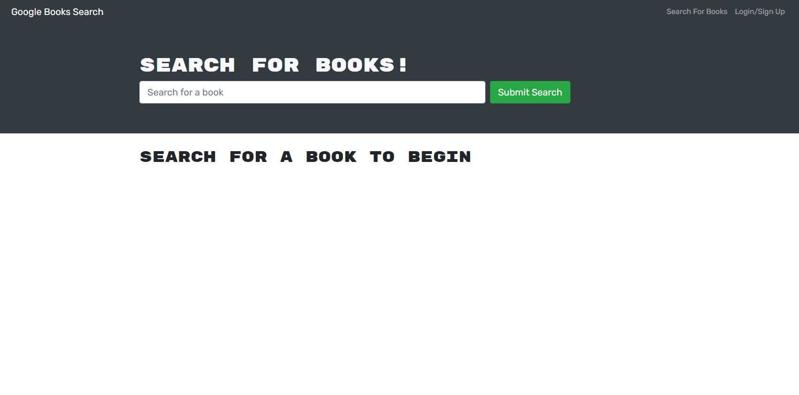
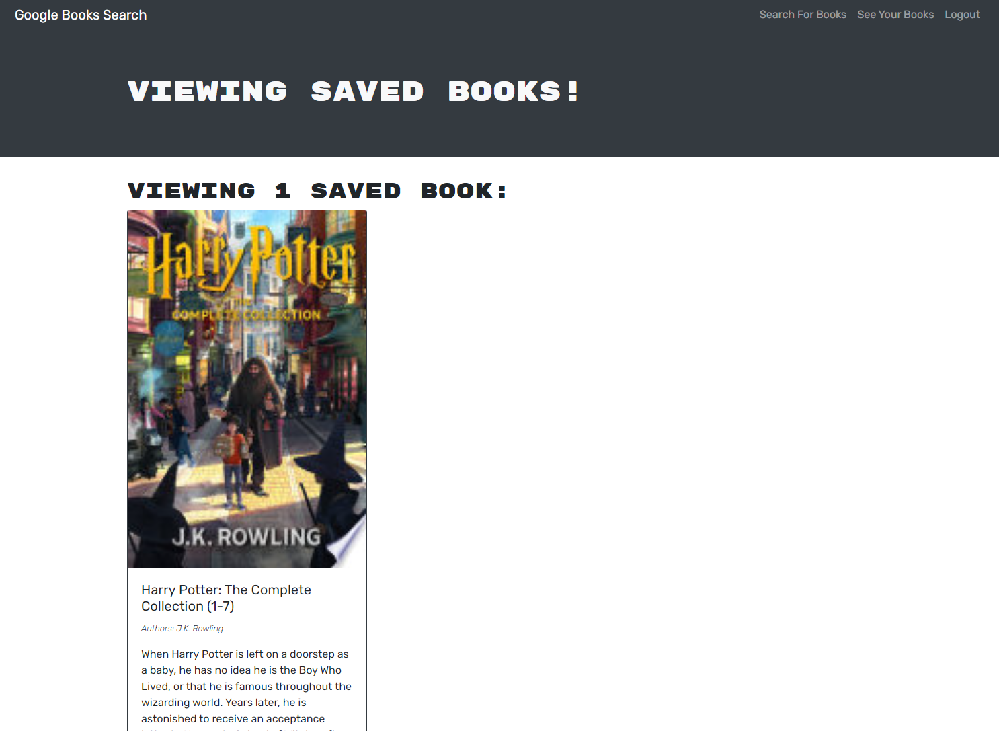

# bookMERN

### By Mackenzie Gray 

[](https://opensource.org/licenses/Apache-2.0)

## Description

An application designed and created for an avid book reader, bookMERN allows for the searching of new books to read which can be saved as a list for future reference and purchase. The front end is built using React which is served with a GraphQL API built with an Apollo server. 

## User Story

```
AS AN avid reader
I WANT to search for new books to read
SO THAT I can keep a list of books to purchase
```

## Link to deployed application

[Click here to view Heroku application]()

## Table of Contents

* [Installation](#Installation)
* [Screenshots](#Screenshots)
* [License](#License)
* [Acknowledgments](#Acknowledgments)
* [Questions](#Questions)

## Installation 

The application will be installed with the following command: 

`npm install`

To run the server and client folder concurrently, use the following command: 

`npm run develop`

## Screenshots





## License

Apache 2.0

#### For more information on the license, click the badge icon in the title section.

## Acknowledgments

University of Sydney Coding Bootcamp

## Questions

### For further information contact using the following:

#### GitHub: [mdkgray](https://github.com/mdkgray)

#### Email: mdkulen@gmail.com

_This README was generated using [README Generator](https://github.com/mdkgray/README_generator)_
